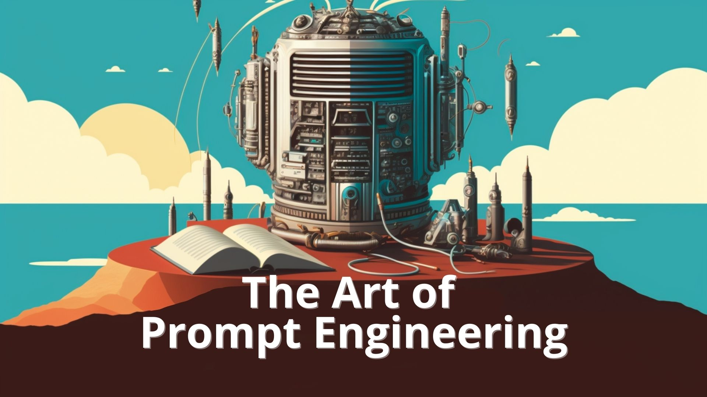

# ChatGPT Prompt Engineering for Developers

This Course is designed to improve and understand how a regular user can improve their prompt interaction using LLM like ChatGPT/ GPT model. Famous Instructor Andrew NG is teaching in very easy manner how to improve and interact with GPT LLM models. And extract meaningful output from the prompt. 

This course is free and worth of spending a time to learn about promt engineering.

---

## Prerequisite

1. This project is based on Python notebook that were taken from the session.To manage the dependencies I have used _virtualenv_ and _poetry_ to create reproducable environment.

2. Setup the environment.

    - Create a virtual environment on location where you have downloaded this project and also install poetry in the virtual environment.
      
        ```shell
        python -m  venv <project-name> poetry
        ```
    - Activate the virtual environment.

        ```shell
        # For Nix Systems/ Mac OS
        source scripts/activate

        # For Windows Systems
        ./Scripts/Activate.ps1
        ```
    - Activate the shell from poetry to make sure everything works fine as poetry is installed in the environment.
        ```shell
        python -m poetry shell
        ```
    - move the folder named PromtENG, where pyproject.toml poetry file is located. Then install the dependencies using the below command.
        ```shell
        python -m poetry install
        ```
    - Now run the jupyter notebook server.
        ```shell
        python -n jupyter notebook
        ```

3. Add your OpenAI API Key in the [.env](.env) file, where environment variable name mentioned as _OPENAI_API_KEY_.

4. Make sure the OpenAI module is installed in the environment. Check with the below command.

    ```shell
    python -m pip show openai
    ```
---

# Total 9 video lectures. Follow the notebooks from the folder: [**promteng**](./PromptENG)

- [**Guidelines**](./PromptENG/l2-guidelines.ipynb)
- [**Iterative**](./PromptENG/l3-iterative-prompt-development.ipynb)
- [**Summarizing**](./PromptENG/l4-summarizing.ipynb)
- [**Inferring**](./PromptENG/l5-inferring.ipynb)
- [**Transforming**](./PromptENG/l6-transforming.ipynb)
- [**Expanding**](./PromptENG/l8-chatbot.ipynb)
- [**ChatBot**](./PromptENG/l8-chatbot.ipynb)
- **Conclusion**
    
    - Use the learning usefully.
    - Do not miss use the LLM fretures for spamming/ destructive works. 
    - Create simple project that leads to better projects.
    - Share with other via word mouth.

---
At the end of the seesion also chance the to join the [DeepLearning.AI](https://www.deeplearning.ai) community as per invite.